# OrangeNews

***
## 프로그램 개요
 수많은 정보가 우수수 쏟아지고 있는 세상에서 우리는 어떤 값이 진실이고 거짓인지 판단하기 어려운 상황에 놓여있습니다. 때론 진실이라고 생각했던 것 마저 단지 황색 언론의 선전이 출처인 경우도 있죠. 다만 이런 상황에서도 진실이라고 하는 것은 깨달음처럼 우리의 머릿속을 강렬하게 스쳐 가는 것이라고 믿고 싶습니다. 우리의 혀를 자극하는 오렌지와 같은 뉴스 사이트, 그런 마음에서 오렌지 뉴스라는 제목을 선정하게 되었습니다.

 기능 면에서는 게시판보다 다양하게 구현하고 싶었기 때문에 뉴스 기사가 업로드되는 사이트를 만들고 싶었습니다. 기사 사이트는 단순 게시글 업로드뿐만 아니라 답글, 댓글, 반응 등을 많은 방식으로 남길 수 있기 때문에 간단한 메서드부터 복잡한 메서드까지 설계할 수 있어 주제를 선정하였습니다

***
### 사용 언어
 1. 언어 및 프레임워크 : JDK-11, JSP, Servlet, CSS
 2. 개발툴 : 이클립스 JEE
 3. DB : Oracle, SqlDeveloper, DBeaver
 4. 서버 : 톰캣 9
 5. 기타 : 어도비 일러스트레이터, 스타 UML, 크롬

***
### 조원 역할 분담
 * 최명혜 : 기사 조회 / 작성 기능, 반응 / 추천 기능, 요구사항 명세서 작성
 * 강철구 : 댓글 기능, 현재 날씨 API 기능, 전체적인 CSS
 * 강기천 : 로그인 / 회원 가입 기능, 로그인 페이지 CSS 제작, 다이어그램 제작
 * 조예찬 : 회원 관련 기능, 쿠키 관리

***
### 요구사항 명세 
 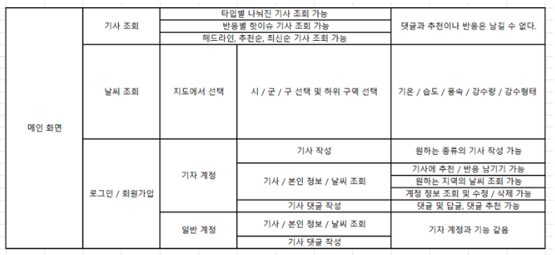

***
### 다이어그램 
 1. 유스케이스 다이어그렘 
 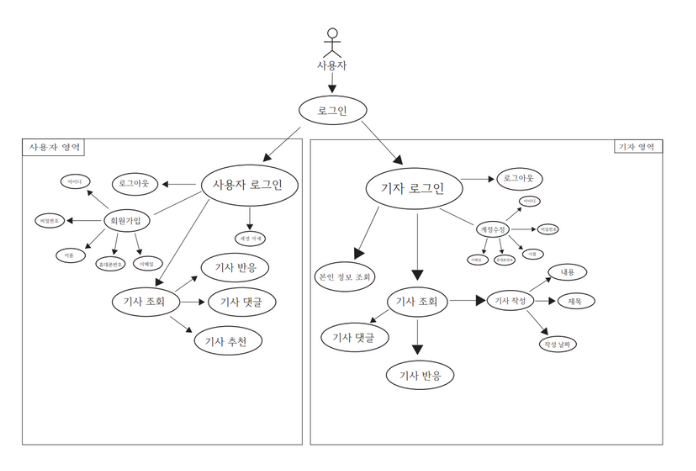
 2. ER 다이어그렘 
 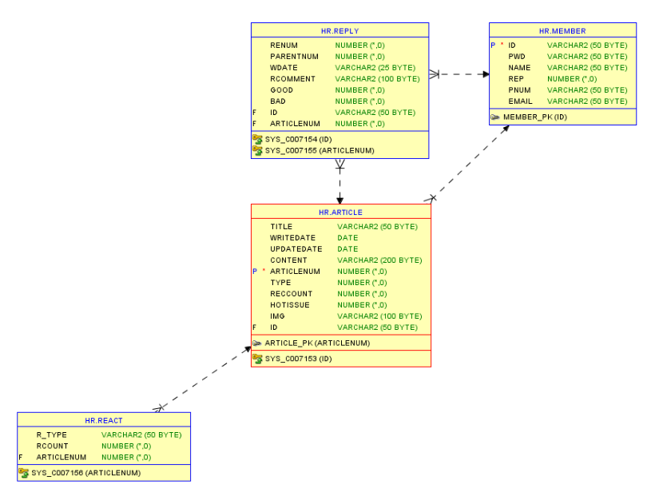
 3. 시퀀스 다이어그렘 
 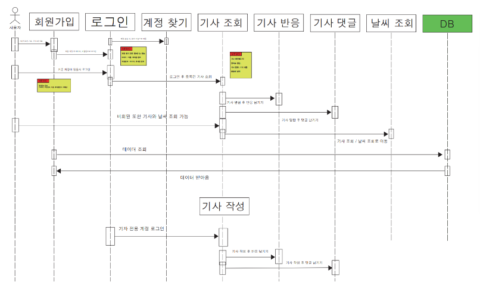
 4. 클래스 다이어그렘 
 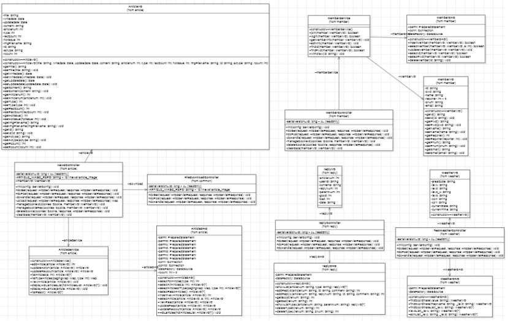
 5. 블럭 다이어그램 
 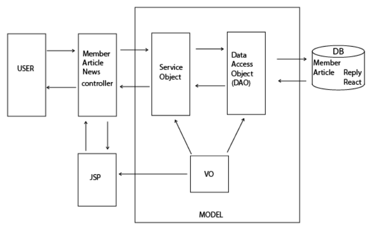

### 구현된 기능
*** 
 1. 기사 작성 기능
 2. 분야별 기사 정렬 기능
 3. 기사당 댓글, 대댓글 작성 기능
 4. 회원 기능
 5. 날씨 API 기능
 6. 기사 리스트 페이징 기능

***
### 핵심 소스코드
 1. 현재 날씨 API  
 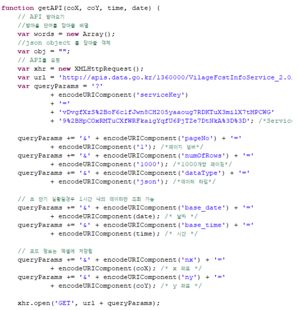

 2. 댓글 기능  
 

 3. 로그인 기능  
 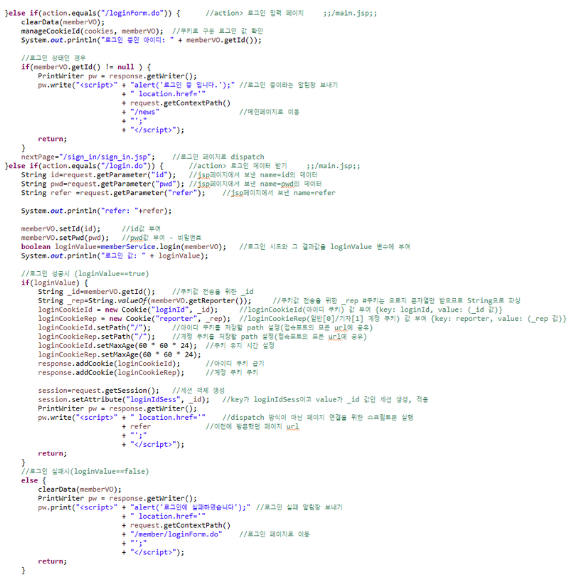

 4. 기사 작성 기능  
 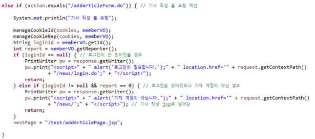

### 실행 화면
***
 1. 리스트 화면  
 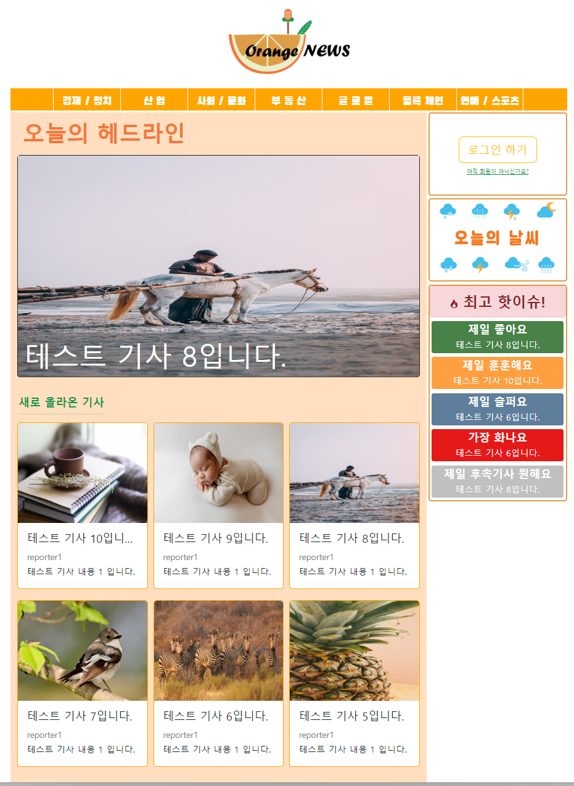

 2. 게시물 읽기 화면  
 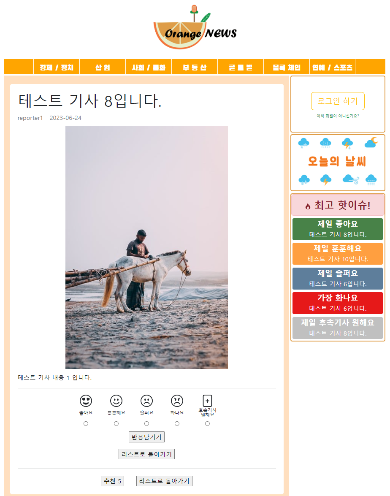

### 해결해야 할 문제
***
 1. 기사 수정 기능이 없다
 2. 반응을 누를 수만 있고 수치로 볼수 없다.
 3. 헤드라인을 하나만 올릴 수 있다.